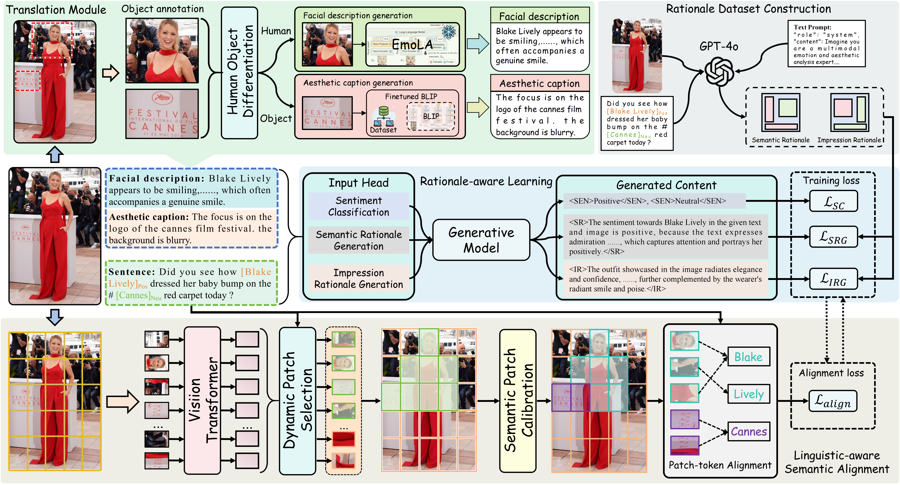

# 🌌 Chimera: A Cognitive & Aesthetic Sentiment Causality Understanding Framework

This repository provides the **source code** and **datasets** for our paper:  
📄 **[Exploring Cognitive and Aesthetic Causality for Multimodal Aspect-Based Sentiment Analysis](https://arxiv.org/pdf/2504.15848?)**


----------

## Overview

<p align="center">
  
</p>

Chimera is a unified framework designed to model **cognitive reasoning** and **aesthetic perception** in multimodal aspect-based sentiment analysis (MABSA).  
It integrates text–image interaction, sentiment causality understanding, and fine-grained multimodal reasoning.

----------

### Requirements

We recommend using **conda** for environment management:

conda env create -f Chimera.yaml


----------

### 📚 Datasets
1. Constructed datasets: Twitter2015 ([twitter2015](data/twitter2015)), Twitter2017 ([twitter2017](data/twitter2017)) and Political Twitter ([political_twitter](data/political_twitter)).
2. Image features can be downloaded from [Google Drive](https://drive.google.com/drive/folders/1bLEz_sr1loC4TPa39S30L4a7lB2r-ACr?usp=sharing). Place the downloaded files in the directories `data/twitter2015` and `data/twitter2017`, respectively. For the `political_twitter` dataset, move the contents of `data/twitter2015` and `data/twitter2017` into `data/political_twitter` and extract the two `.zip` files into the same directory.


----------

### 🤖 Pretrained Model
- The Flan-T5 model is utilized as the backbone. Download the pre-trained model [google/flan-t5-base](https://huggingface.co/google/flan-t5-base) and save it in the directory `pretrained/flan-t5-base`.


----------

###  🏋️ Training & Evaluation

python run_chimera_15.py

python run_chimera_17.py

python run_chimera_political.py

----------

###  📖 Citation
If you find this repository helpful, please consider starring ⭐ the repo and citing our related work:

```
@article{xiao2025exploring,
  title={Exploring Cognitive and Aesthetic Causality for Multimodal Aspect-Based Sentiment Analysis},
  author={Xiao, Luwei and Mao, Rui and Zhao, Shuai and Lin, Qika and Jia, Yanhao and He, Liang and Cambria, Erik},
  journal={IEEE Transactions on Affective Computing},
  year={2025},
  publisher={IEEE}
}

@article{xiao2024atlantis,
  title={Atlantis: Aesthetic-oriented multiple granularities fusion network for joint multimodal aspect-based sentiment analysis},
  author={Xiao, Luwei and Wu, Xingjiao and Xu, Junjie and Li, Weijie and Jin, Cheng and He, Liang},
  journal={Information Fusion},
  volume={106},
  pages={102304},
  year={2024},
  publisher={Elsevier}
}

@inproceedings{xiao2024vanessa,
  title={Vanessa: Visual connotation and aesthetic attributes understanding network for multimodal aspect-based sentiment analysis},
  author={Xiao, Luwei and Mao, Rui and Zhang, Xulang and He, Liang and Cambria, Erik},
  booktitle={Findings of the Association for Computational Linguistics: EMNLP 2024},
  pages={11486--11500},
  year={2024}
}


```


### 🙏 Acknowledgements

This work is primarily built upon the repositories of [MDCA](https://github.com/rf-x/MDCA) and [LAPS](https://github.com/CrossmodalGroup/LAPS). We extend our sincere gratitude to all contributors for their valuable insights and support.

----------

✨ Thank you for your interest in Chimera! Feel free to open issues or pull requests to help improve this project.
